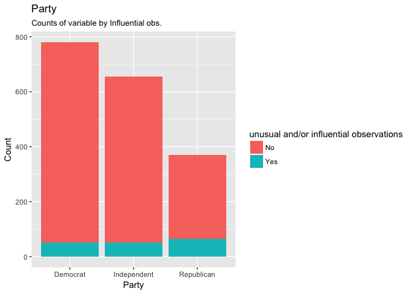
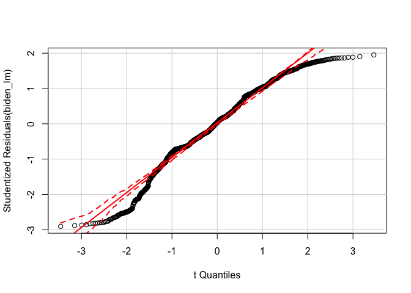
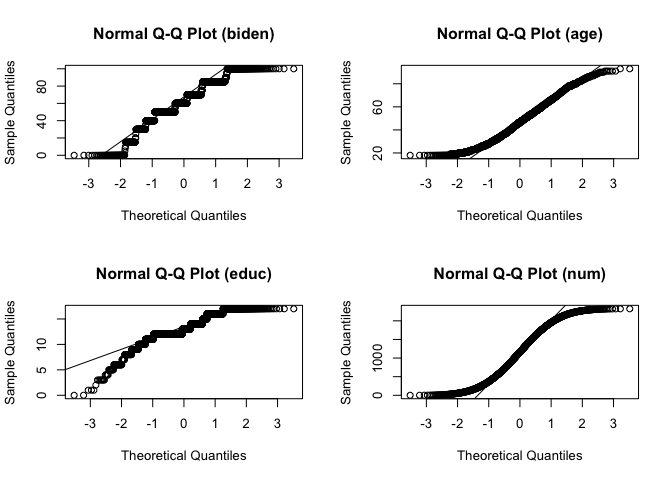
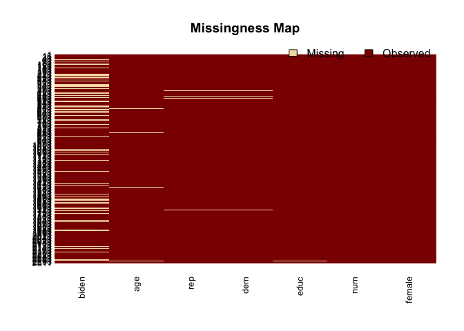

Problem set \#3: Hodgepodge
================
Zhuo Leng

Part 1:Regression diagnostics
-----------------------------

Question 1
==========

Test the model to identify any unusual and/or influential observations. Identify how you would treat these observations moving forward with this research. Note you do not actually have to estimate a new model, just explain what you would do. This could include things like dropping observations, respecifying the model, or collecting additional variables to control for this influential effect.

    ## # A tibble: 1,807 <U+00D7> 7
    ##    biden female   age  educ   dem   rep   num
    ##    <int>  <int> <int> <int> <int> <int> <dbl>
    ## 1     90      0    19    12     1     0     1
    ## 2     70      1    51    14     1     0     2
    ## 3     60      0    27    14     0     0     3
    ## 4     50      1    43    14     1     0     4
    ## 5     60      1    38    14     0     1     5
    ## 6     85      1    27    16     1     0     6
    ## 7     60      1    28    12     0     0     7
    ## 8     50      0    31    15     1     0     8
    ## 9     50      1    32    13     0     0     9
    ## 10    70      0    51    14     1     0    10
    ## # ... with 1,797 more rows

    ##          term    estimate  std.error statistic      p.value
    ## 1 (Intercept) 68.62101396 3.59600465 19.082571 4.337464e-74
    ## 2         age  0.04187919 0.03248579  1.289154 1.975099e-01
    ## 3      female  6.19606946 1.09669702  5.649755 1.863612e-08
    ## 4        educ -0.88871263 0.22469183 -3.955251 7.941295e-05

 By using bubble plot, we get to know the unusual values with high leverage, discrepancy or influence.We notice that the majority of observations are in lower left corner of the graph.Next step, in order to get more understanding of outliers, we use histograms.

``` r
biden_augment <- biden_augment %>%
  mutate(`unusual and/or influential observations` = ifelse(num %in% biden_filter$num, "Yes", "No"))

biden_augment %>% 
  ggplot(aes(age, fill = `unusual and/or influential observations`)) +
    geom_histogram(bins = 10) + 
    labs(title = "Age",
         subtitle = "Counts of variable by Influential obs.",
         x = "Age",
         y = "Count")
```


``` r
biden_augment %>% 
  ggplot(aes(biden, fill = `unusual and/or influential observations`)) +
    geom_histogram(bins = 10) + 
    labs(title = "Biden Warmth Score",
         subtitle = "Counts of variable by Influential obs.",
         x = "Score",
         y = "Count")
```


``` r
biden_augment %>% 
  mutate(female = ifelse(female == 1, "Female", "Male")) %>%
  ggplot(aes(female, fill = `unusual and/or influential observations`)) +
    geom_histogram(stat = "count", bins = 10) + 
    labs(title = "Gender",
         subtitle = "Counts of variable by Influential obs.",
         x = "Gender",
         y = "Count")
```


``` r
biden_augment %>% 
  mutate(party = ifelse(dem == 1, "Democrat", 
                        ifelse(rep == 1, "Republican",
                               "Independent"))) %>%
  ggplot(aes(party, fill = `unusual and/or influential observations`)) +
    geom_histogram(stat = "count", bins = 10) + 
    labs(title = "Party",
         subtitle = "Counts of variable by Influential obs.",
         x = "Party",
         y = "Count")
```

 From the histogram, we could classify the point by unusual or influential. Different age people seems have different proportion of outliers. Most of the outliers with high biden score are Democrate(party affiliation) from both genders. The proportion of unusual or influential of male are larger than that of female. Also, republican get the largest proportion of unusual or influential.

Next step: In next step of research, I will try to add party afilliation to my model because different parties seems hace different proportion of unual or influential point. In addition, we will also consider add interaction terms between age and party to control the effect of outlier.

Question 2
==========

Test for non-normally distributed errors. If they are not normally distributed, propose how to correct for them.

``` r
tidy(biden_lm)
```

    ##          term    estimate  std.error statistic      p.value
    ## 1 (Intercept) 68.62101396 3.59600465 19.082571 4.337464e-74
    ## 2         age  0.04187919 0.03248579  1.289154 1.975099e-01
    ## 3      female  6.19606946 1.09669702  5.649755 1.863612e-08
    ## 4        educ -0.88871263 0.22469183 -3.955251 7.941295e-05

``` r
car::qqPlot(biden_lm)
```

 From the quantile-comparison plot, graphing for each observation its studentized residual on the yy axis and the corresponding quantile in the tt-distribution on the xx axis. There are observations fall outside this dash line range,so this plot indicate there exist non-normally distributed errors.

``` r
augment(biden_lm, biden_data) %>%
  mutate(.student = rstudent(biden_lm)) %>%
  ggplot(aes(.student)) +
  geom_density(adjust = .5) +
  labs(x = "Studentized residuals",
       y = "Estimated density")
```

 From the density plot of the studentized residuals, we can also see that the residuals are skewed. In this case we need to use power and log transformations to correct this problem. I try 2 power transformation first.

``` r
biden_data <- biden_data %>%
  mutate(biden_power = biden^2)

biden_lm2 <- lm(biden_power ~ age + female + educ, data = biden_data)
tidy(biden_lm2)
```

    ##          term    estimate std.error statistic      p.value
    ## 1 (Intercept) 4875.652407 422.11541 11.550520 7.993579e-30
    ## 2         age    9.927195   3.81333  2.603288 9.309187e-03
    ## 3      female  690.088285 128.73529  5.360521 9.366382e-08
    ## 4        educ  -98.393026  26.37535 -3.730492 1.970200e-04

``` r
car::qqPlot(biden_lm2)
```


``` r
augment(biden_lm2, biden_data) %>%
  mutate(.student = rstudent(biden_lm2)) %>%
  ggplot(aes(.student)) +
  geom_density(adjust = .5) +
  labs(x = "Studentized residuals",
       y = "Estimated density")
```

 From summary table, some varibales are more significant. However, from the quantile-comparison plot, There still observations fall outside this dash line range,and indicate there still exist non-normally distributed errors. Then I could try to use power 3, 4, -2 for examples to test how to make the error of linear model more normally distributed.

``` r
biden_data <- biden_data %>%
  mutate(biden_power2 = biden^3)

biden_lm3 <- lm(biden_power2 ~ age + female + educ, data = biden_data)
tidy(biden_lm3)
```

    ##          term   estimate  std.error statistic      p.value
    ## 1 (Intercept) 372297.403 44190.2447  8.424878 7.271669e-17
    ## 2         age   1272.769   399.2083  3.188232 1.456014e-03
    ## 3      female  68950.456 13476.9875  5.116162 3.450192e-07
    ## 4        educ -10053.975  2761.1719 -3.641199 2.790310e-04

``` r
car::qqPlot(biden_lm3)
```


``` r
augment(biden_lm3, biden_data) %>%
  mutate(.student = rstudent(biden_lm3)) %>%
  ggplot(aes(.student)) +
  geom_density(adjust = .5) +
  labs(x = "Studentized residuals",
       y = "Estimated density")
```

 \# Question 3 \#

Test for heteroscedasticity in the model. If present, explain what impact this could have on inference.

``` r
biden_data %>%
  add_predictions(biden_lm) %>%
  add_residuals(biden_lm) %>%
  ggplot(aes(pred, resid)) +
  geom_point(alpha = .2) +
  geom_hline(yintercept = 0, linetype = 2) +
  geom_quantile(method = "rqss", lambda = 5, quantiles = c(.05, .95)) +
  labs(title = "Homoscedastic variance of error terms",
       x = "Predicted values",
       y = "Residuals")
```


From the Homoscedastic varieance of error terms plot, we could know that heteroscedasticity exsit in the model.

``` r
bptest(biden_lm)
```

    ## 
    ##  studentized Breusch-Pagan test
    ## 
    ## data:  biden_lm
    ## BP = 22.559, df = 3, p-value = 4.989e-05

From the bptest result, it could verify our from indusction plot above.

``` r
# convert residuals to weights
weights <- 1 / residuals(biden_lm)^2

biden_wls <- lm(biden ~ age + female + educ, data = biden_data, weights = weights)

tidy(biden_wls)
```

    ##          term   estimate   std.error statistic       p.value
    ## 1 (Intercept) 69.0172894 0.336782518 204.93133  0.000000e+00
    ## 2         age  0.0388289 0.002269595  17.10830  6.352772e-61
    ## 3      female  5.9697148 0.128752633  46.36577 1.196475e-309
    ## 4        educ -0.9098030 0.028794203 -31.59674 9.448678e-175

We see some mild changes in the estimated parameters, but reductions in the standard errors. We need to use more robust estimation procedure: Huber-White standard errors .

``` r
#Huber-White standard errors 
bd_std_err <- hccm(biden_lm, type = "hc1") %>%
  diag %>%
  sqrt

tidy(biden_lm) %>%
  mutate(std.error.rob = bd_std_err)
```

    ##          term    estimate  std.error statistic      p.value std.error.rob
    ## 1 (Intercept) 68.62101396 3.59600465 19.082571 4.337464e-74    3.54995231
    ## 2         age  0.04187919 0.03248579  1.289154 1.975099e-01    0.03327666
    ## 3      female  6.19606946 1.09669702  5.649755 1.863612e-08    1.10635332
    ## 4        educ -0.88871263 0.22469183 -3.955251 7.941295e-05    0.22263100

Question 4
==========

Test for multicollinearity. If present, propose if/how to solve the problem.

``` r
ggpairs(select_if(biden_data, is.numeric))
```


``` r
vif(biden_lm)
```

    ##      age   female     educ 
    ## 1.013369 1.001676 1.012275

We can use VIF to take a look at our coefficient inflation factor.From the value of vif, there's no multicollinearity in the model.

Part 2:Interaction terms
------------------------

Question 1
==========

Evaluate the marginal effect of age on Joe Biden thermometer rating, conditional on education. Consider the magnitude and direction of the marginal effect, as well as its statistical significance.

``` r
biden_lm_interaction <- lm(biden ~ age + educ + age*educ, data = biden_data)
tidy(biden_lm_interaction)
```

    ##          term   estimate  std.error statistic      p.value
    ## 1 (Intercept) 38.3735103 9.56356681  4.012468 6.254443e-05
    ## 2         age  0.6718750 0.17049152  3.940812 8.430505e-05
    ## 3        educ  1.6574253 0.71399213  2.321350 2.037897e-02
    ## 4    age:educ -0.0480341 0.01290186 -3.723037 2.028851e-04

``` r
# function to get point estimates and standard errors
# model - lm object
# mod_var - name of moderating variable in the interaction
instant_effect <- function(model, mod_var){
  # get interaction term name
  int.name <- names(model$coefficients)[[which(str_detect(names(model$coefficients), ":"))]]
  marg_var <- str_split(int.name, ":")[[1]][[which(str_split(int.name, ":")[[1]] != mod_var)]]
  # store coefficients and covariance matrix
  beta.hat <- coef(model)
  cov <- vcov(model)
  # possible set of values for mod_var
  if(class(model)[[1]] == "lm"){
    z <- seq(min(model$model[[mod_var]]), max(model$model[[mod_var]]))
  } else {
    z <- seq(min(model$data[[mod_var]]), max(model$data[[mod_var]]))
  }
  # calculate instantaneous effect
  dy.dx <- beta.hat[[marg_var]] + beta.hat[[int.name]] * z
  # calculate standard errors for instantaeous effect
  se.dy.dx <- sqrt(cov[marg_var, marg_var] +
                     z^2 * cov[int.name, int.name] +
                     2 * z * cov[marg_var, int.name])
  # combine into data frame
  data_frame(z = z,
             dy.dx = dy.dx,
             se = se.dy.dx)
}


# point range plot
instant_effect(biden_lm_interaction, "educ") %>%
  ggplot(aes(z, dy.dx,
             ymin = dy.dx - 1.96 * se,
             ymax = dy.dx + 1.96 * se)) +
  geom_pointrange() +
  geom_hline(yintercept = 0, linetype = 2) +
  labs(title = "Marginal effect of Age",
       subtitle = "Conditional on Education",
       x = "Education",
       y = "Estimated marginal effect")
```


``` r
linearHypothesis(biden_lm_interaction, "age + age:educ")
```

    ## Linear hypothesis test
    ## 
    ## Hypothesis:
    ## age  + age:educ = 0
    ## 
    ## Model 1: restricted model
    ## Model 2: biden ~ age + educ + age * educ
    ## 
    ##   Res.Df    RSS Df Sum of Sq     F    Pr(>F)    
    ## 1   1804 985149                                 
    ## 2   1803 976688  1    8461.2 15.62 8.043e-05 ***
    ## ---
    ## Signif. codes:  0 '***' 0.001 '**' 0.01 '*' 0.05 '.' 0.1 ' ' 1

We could see the marginal effect of age conditional on education from the plot. And also from the Hypothesis test we could know from the p-value which is under 0.05, the marginal effect is significant.

Question 2
==========

Evaluate the marginal effect of education on Joe Biden thermometer rating, conditional on age. Consider the magnitude and direction of the marginal effect, as well as its statistical significance.

``` r
# point range plot
instant_effect(biden_lm_interaction, "age") %>%
  ggplot(aes(z, dy.dx,
             ymin = dy.dx - 1.96 * se,
             ymax = dy.dx + 1.96 * se)) +
  geom_pointrange() +
  geom_hline(yintercept = 0, linetype = 2) +
  labs(title = "Marginal effect of Education",
       subtitle = "Conditional on Age",
       x = "Age",
       y = "Estimated marginal effect")
```


``` r
linearHypothesis(biden_lm_interaction, "educ + age:educ")
```

    ## Linear hypothesis test
    ## 
    ## Hypothesis:
    ## educ  + age:educ = 0
    ## 
    ## Model 1: restricted model
    ## Model 2: biden ~ age + educ + age * educ
    ## 
    ##   Res.Df    RSS Df Sum of Sq      F  Pr(>F)  
    ## 1   1804 979537                              
    ## 2   1803 976688  1    2849.1 5.2595 0.02194 *
    ## ---
    ## Signif. codes:  0 '***' 0.001 '**' 0.01 '*' 0.05 '.' 0.1 ' ' 1

We could see the marginal effect of education conditional on age from the plot. And also from the Hypothesis test we could know from the p-value which is under 0.05, the marginal effect is significant. \#\# part 3 Missing data \#\# \# Question \# This time, use multiple imputation to account for the missingness in the data. Consider the multivariate normality assumption and transform any variables as you see fit for the imputation stage. Calculate appropriate estimates of the parameters and the standard errors and explain how the results differ from the original, non-imputed model.

``` r
##multivariate normality assumption

biden_new <- biden %>%
  select(-female, -rep, -dem)

# MVN tests
hzTest(biden_new, qqplot = FALSE)
```

    ##   Henze-Zirkler's Multivariate Normality Test 
    ## --------------------------------------------- 
    ##   data : biden_new 
    ## 
    ##   HZ      : 5.858566 
    ##   p-value : 0 
    ## 
    ##   Result  : Data are not multivariate normal. 
    ## ---------------------------------------------

``` r
mardiaTest(biden_new, qqplot = FALSE)
```

    ##    Mardia's Multivariate Normality Test 
    ## --------------------------------------- 
    ##    data : biden_new 
    ## 
    ##    g1p            : 1.248541 
    ##    chi.skew       : 379.9726 
    ##    p.value.skew   : 2.88198e-68 
    ## 
    ##    g2p            : 24.11474 
    ##    z.kurtosis     : 0.3538344 
    ##    p.value.kurt   : 0.723463 
    ## 
    ##    chi.small.skew : 380.847 
    ##    p.value.small  : 1.899981e-68 
    ## 
    ##    Result          : Data are not multivariate normal. 
    ## ---------------------------------------

``` r
# Plot
uniPlot(biden_new, type = "qqplot") 
```

 By testing the multivariate normality, I use MVN tests to do that. From the p-value of the test, we could know the data is not multivariate normality. Also, after plotting qq plot, from the shape of plot, we could first try square root or log to tranform the model. Below, I try square root first.

``` r
#transform
biden_test <- biden_new %>%
  mutate(sqrt_age = sqrt(age),
         sqrt_educ = sqrt(educ))

uniPlot(biden_test, type = "qqplot")
```


``` r
hzTest(biden_test %>%
         select(sqrt_educ, sqrt_age))
```

    ##   Henze-Zirkler's Multivariate Normality Test 
    ## --------------------------------------------- 
    ##   data : biden_test %>% select(sqrt_educ, sqrt_age) 
    ## 
    ##   HZ      : 21.04497 
    ##   p-value : 0 
    ## 
    ##   Result  : Data are not multivariate normal. 
    ## ---------------------------------------------

After transforming, the result is still not mutivariate normality although the result has been inproved.

``` r
##function
mi.meld.plus <- function(df_tidy){
  # transform data into appropriate matrix shape
  coef.out <- df_tidy %>%
    select(id:estimate) %>%
    spread(term, estimate) %>%
    select(-id)
  
  se.out <- df_tidy %>%
    select(id, term, std.error) %>%
    spread(term, std.error) %>%
    select(-id)
  
  combined.results <- mi.meld(q = coef.out, se = se.out)
  
  data_frame(term = colnames(combined.results$q.mi),
             estimate.mi = combined.results$q.mi[1, ],
             std.error.mi = combined.results$se.mi[1, ])
}


biden.out <- biden %>%
  mutate(dem = as.numeric(dem),
         rep = as.numeric(rep)) %>%
  amelia(., m=5, sqrts = c("age", "educ"),
         noms = c("female", "dem", "rep"), p2s = 0)
missmap(biden.out)
```



``` r
models_imp <- data_frame(data = biden.out$imputations) %>%
  mutate(model = map(data, ~ lm(biden ~ age + female + educ,
                                data = .x)),
         coef = map(model, tidy)) %>%
  unnest(coef, .id = "id")
models_imp
```

    ## # A tibble: 20 <U+00D7> 6
    ##       id        term    estimate  std.error statistic       p.value
    ##    <chr>       <chr>       <dbl>      <dbl>     <dbl>         <dbl>
    ## 1   imp1 (Intercept) 65.87677212 2.99053171 22.028448  8.347314e-98
    ## 2   imp1         age  0.06989639 0.02777457  2.516561  1.191762e-02
    ## 3   imp1      female  5.18733941 0.96524426  5.374121  8.465097e-08
    ## 4   imp1        educ -0.75234890 0.18580386 -4.049156  5.308973e-05
    ## 5   imp2 (Intercept) 66.86494186 3.00255189 22.269371  1.011228e-99
    ## 6   imp2         age  0.03872601 0.02782384  1.391829  1.641078e-01
    ## 7   imp2      female  5.67105319 0.97093425  5.840821  5.924231e-09
    ## 8   imp2        educ -0.74186290 0.18682486 -3.970900  7.378216e-05
    ## 9   imp3 (Intercept) 65.79501671 2.97847298 22.090184  2.701979e-98
    ## 10  imp3         age  0.07762711 0.02777504  2.794851  5.235079e-03
    ## 11  imp3      female  5.21299604 0.96490152  5.402620  7.238240e-08
    ## 12  imp3        educ -0.77167270 0.18528752 -4.164731  3.231217e-05
    ## 13  imp4 (Intercept) 66.16309844 2.99677452 22.078104  3.369832e-98
    ## 14  imp4         age  0.05800399 0.02789868  2.079095  3.771831e-02
    ## 15  imp4      female  5.79737292 0.96596853  6.001617  2.260845e-09
    ## 16  imp4        educ -0.78343532 0.18606739 -4.210492  2.645370e-05
    ## 17  imp5 (Intercept) 67.06860053 2.97777870 22.523031 9.383257e-102
    ## 18  imp5         age  0.05203491 0.02765663  1.881463  6.003419e-02
    ## 19  imp5      female  5.58023802 0.96616924  5.775632  8.694870e-09
    ## 20  imp5        educ -0.78185649 0.18517365 -4.222288  2.511621e-05

``` r
# compare results
tidy(biden_lm) %>%
  left_join(mi.meld.plus(models_imp)) %>%
  select(-statistic, -p.value)
```

    ##          term    estimate  std.error estimate.mi std.error.mi
    ## 1 (Intercept) 68.62101396 3.59600465 66.35368593   3.05615030
    ## 2         age  0.04187919 0.03248579  0.05925768   0.03240102
    ## 3      female  6.19606946 1.09669702  5.48979992   1.01268223
    ## 4        educ -0.88871263 0.22469183 -0.76623526   0.18692396

We could see from the table, after inputing, the model has not change significantly. I think mainly because the missing data in the dataset is not that much, so although impute the missing value, the model still similar. What's more, the data is not multivatiate normal, so maybe it will affect the result.
